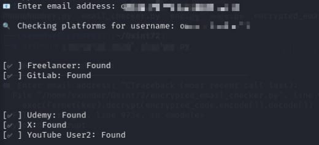
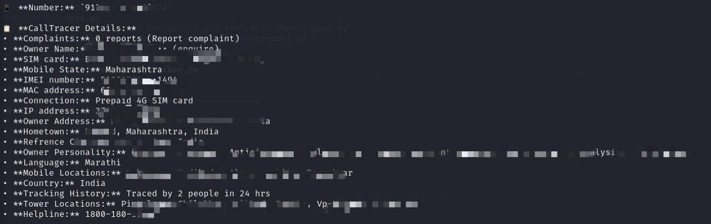

# InboxMan
`InboxMan` is a powerful,  OSINT toolkit

## 🔍 Features
### 🔹 Email Checker
- Checks presence of email/usernames across 500+ platforms
- Fast, reliable JSON-driven analysis
- Ideal for sockpuppet detection, fraud OSINT, and social footprint mapping

- 

### 🔹 Phone Number Tracer
- Fetches real-time phone data
- Extracts info like:
  - Owner name
  - SIM provider
  - MAC address
  - IMEI
  - Location, IP & tower trace
 
  - 

